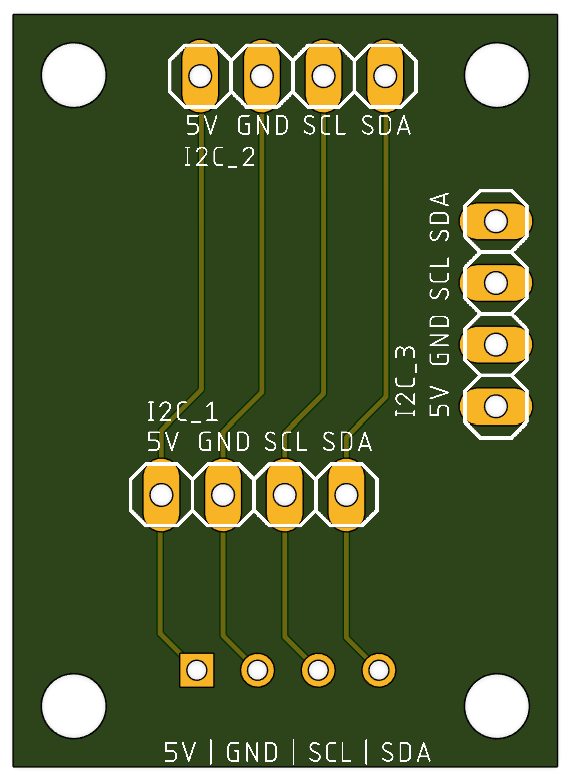

This post will be mostly about 3d printing air quality and especially air safety. Before starting I want to mention that I am no professional (far from it to be honest), I'm just a hobbyist focused on making my setup as safe as possible - so read the next lines with caution and do not take this as medical / health advice or anything more than a random blog post on the internet. As my two 3d printers are placed inside my "office" (it's more a hobby room than an office, but let's keep pretending) and I spend a significant amount of time inside this room, I wanted a way to measure air quality in my room.

The BOM can be found on [Printables](https://www.printables.com/model/989029-bentocore-bentobox-controller-with-sensors) or [MakerWorld](https://makerworld.com/en/models/610820#profileId-533953).

## How it started

This started with an air monitor from AirGradient that I flashed with an ESPHome alternative to incorporate it into my HomeAssistant dashboard. Then I thought about enclosing my i3 Mega S (once this ongoing project is finished there will be a post about it) in an IKEA Platsa cupboard. Though soon after [I bought a P1S](/posts/my-bambu-p1s), which is why this project is currently halted. But the general idea was to implement an air scrubber inside the enclosure with an exhaust filter to have the air pressure inside the chamber lower than outside (basically "air flows in").

## Adapting for the P1S

Basically the P1S already has an exhaust fan (there is a great mod where you can put in your own carbon pellets to filter out VOCs), so I only needed the air scrubber to run while printing. For this I settled for the [BentoBox](https://www.printables.com/model/272525-bentobox-v20-carbon-filter-for-bambu-lab-x1c-enclo/collections?lang=de). The Hepa filters are mentioned in the BOM of the project itself, for activated carbon I am using [this](https://www.amazon.de/gp/product/B098ZT81FP/ref=ppx_yo_dt_b_search_asin_title?ie=UTF8&psc=1).

But there is one major drawback (at least for me): I have no idea about the stats inside the chamber. Of course due to the AirGradient I now the "air quality" at my desk, but to really build an automation for the BentoBox to run I needed the exact values inside the chamber. After a quick search on Printables I found a project that tries to do that, but uses a RaspberryPi Pico (which I am not familiar with). Additionally this project didn't use a particulate matter sensor, which I wanted to include as well.

## Building The Add On

As you know from the title, my add on is called "BentoCore" and the idea behind it is simple: the bottom funnel of the BentoBox will be replaced by an adapted funnel with a base piece that allows to house the ESP8266 and the PM2.5 sensor. It should also allow to attach a little breakout case if you wanted to attach the VOC and Temp/Humidity sensor. This is how the final version will look like:


The biggest problem was of course the constrained space, I didn't want the total height of the tower to be too big, so that's why I constrained myself with around 35mm of max height (the final base is 33mm in height). Additionally the dimensions in in x and y are already set by the BentoBox itself, though with the "breakout" I cheated a little there. Nevertheless, with the PMS5003 taking up nearly half the internal space (see picture below) I was getting a bit worried that this whole project might be doomed.


While it would definitely be possible to solder the ESP8266 and the few headers for the connections on a breadboard manually I decided to learn a new thing here as well: designing a custom PCB (thanks at this point to [Christian](https://hp.p4s3r0.it/) for helping me out with that).


As you can see from the picture the PCB fills up the space neatly and while it certainly would have been possible to incorporate the two I²C sensors into this board, I decided to keep them external.

The last thing I want to mention here are the two "outward" facing ports:


Both are JST-SM panel mounts and the 4 pin version (above) is used to connect the breakout case with the I²C interface on the PCB. PSA: in my opinion (depending on if you plan to place the breakout box on the duct or not) this 4 pin connector is not needed and even rather complicates the connection of the box - nevertheless I wanted to keep the connector as it is still very much possible to just route the cables through the hole of the connector. The bottom one (2 pin) is used to power the whole thing. To ease the routing of the power cables the BentoCore base contains a cutout on the bottom, to route the cables underneath the base. There will be an update soon that will incorporate small pins that will keep the cables inside this channel, as I noticed - when installing my own - that the cables tend to fall out of the channel (if you already printed it just fix them with a piece of tape).

### The PCB design

**Please note that while I’ve put in effort to design this PCB, I am by no means an expert in PCB design. As such, I must emphasize that any use of this PCB is entirely at your own risk. I cannot be held responsible for any potential damage or issues that may arise from its use. By using this PCB, you acknowledge and accept that I am not liable for any consequences, including but not limited to damage to hardware, malfunctioning components, or any other related concerns. Proceed with caution and ensure you are fully aware of the risks involved.**

Now that this is out of the way, let's talk about my ideas and thoughts behind the PCB design. First of all, I wanted to buy as little parts as possible, that's why I incorporated a glass fuse instead of an SMD fuse. While the latter would provide a smaller footprint, I tried to do the design without it, as I said to save some costs. The glass fuse is rated for 1A, as I calculated that the total amount of power draw this board and the BentoBox should have, would be around 0.75A - additionally I am using a 1A wallplug to power this thing.

The MOSFET used to regulate the speed of the two fans is an IRLZ34N, again not an SMD part, due to me having the through hole components on hand.

The remaining connectors are just either 2 pin or 4 pin JST-XH connectors and one single pin header. Though one 2 pin JST-XH connector and the single pin header are unused for the BentoCore project, they will be used when I share my Platsa enclosure build (see now it's coming full circle here 😉).

The microcontroller powering this whole setup should have been an ESP32 at the beginning, though the ESP32s I had on hand were just to big. That's why I settled for an ESP8266. Maybe I'll create a future version of this whole project using an ESP32 as this microcontroller provides hardware PWM support and doesn't need to rely on software as the 8266 does. For now though, I am quite happy with the ESP8266.

The breakout PCB technically doesn't need to be a professionally manufactored PCB either, as it is basically just an I²C distribution plate, as seen in the picture below.


Again for this project only two of the three connections are needed, but I plan on reusing this for the Platsa enclosure as well. Additionally there might be a version where a small OLED screen will be included in the breakout box lid, as the connection is there and there is still a little bit power left to use.

### Assembly

I highly recommend to print all of the files from [Printables](https://www.printables.com/model/989029-bentocore-bentobox-controller-with-sensors) or [MakerWorld](https://makerworld.com/en/models/610820#profileId-533953) but the only necessary parts for this project are the base and the fanduct. The reason behind the fan case is to have the cutout premade so you can route the wires down more easily.

Then you just need to print everything, either order the PCB using the [gerber files from github](https://github.com/aurarius1/BentoCore) or solder everything together yourself, put in the heat inserts / magnets and wire everything up. The PCBs are mounted using the M2.5 heat inserts and the base and fanduct are connected using the M3 heat inserts. Remember to flash the ESPHome Config to your ESP before inserting it into the base (config can be found on [Github](https://github.com/aurarius1/BentoCore)).

That's it, plug in your BentoCore powered BentoBox and you are good to go. If you want to route the cables inside the P1S/X1C chamber there is a small hole on the left side of the printer where two 22AWG wires fit through very neatly.

## HomeAssistant

First of all you need ESPHome to be configured in HomeAssistant. After flashing the microcontroller and plugging everything in, HomeAssistant should detect this device, using the name you gave it (if you did not edit the config from Github it should be P1S BentoBox). Navigating to your devices and selecting this device, after a few minutes you should see something like this:


While the "Lights" switch and the "PWM Enclosure Fan" can be ignored (or entirely removed from the config - as they are only needed in the Platsa enclosure) the "Fan" control should already control your BentoBox fans, if you wired everything correctly. The sensors should give some readings as well (the VOC and PM sensor take a few minutes to fully boot and report values).

Now you can build your own dashboard around this setup (or incoroporate the BentoBox in your existing dashboard). In a future post I'll share my whole dashboard, but due to it not being finished I'll only share the BentoBox related stuff right now.

### BentoBox "Dashboard"

Basically my dashboard follows a simple layout, I first needed a control slider for the fans then I wanted to keep track on when I changed the activated carbon / hepa filter and lastly some indication of the current air "quality" inside the chamber.


If you want to create this layout for your dashboard as well here is the configuration to achieve that:

```yaml
- type: vertical-stack
  title: BentoBox
  cards:
    - type: conditional
      card:
        type: custom:mushroom-fan-card
        entity: fan.p1s_bentobox_fan
        name: BentoBox
        icon_animation: true
        show_percentage_control: true
        fill_container: false
        layout: horizontal
      conditions:
        - condition: state
          entity: fan.p1s_bentobox_fan
          state_not: unavailable
        - condition: state
          entity: sensor.p1s_bentobox_fan
          state_not: unknown
    - type: custom:decluttering-card
      template: filter_card
      variables:
        - name: Activated Carbon
        - change_date: input_datetime.p1s_bento_box_carbon
        - lifecycle_in_months: 1
    - type: custom:decluttering-card
      template: filter_card
      variables:
        - name: Hepa
        - change_date: input_datetime.p1s_bento_box_hepa
        - lifecycle_in_months: 2
    - type: horizontal-stack
      cards:
        - type: sensor
          graph: line
          entity: sensor.p1s_bentobox_voc_index
          detail: 1
          icon: mdi:air-filter
          name: P1S VOC
        - type: sensor
          graph: line
          entity: sensor.p1s_bentobox_temperature
          detail: 1
          name: P1S ChamberTemp
    - type: horizontal-stack
      cards:
        - type: sensor
          graph: line
          entity: sensor.p1s_bentobox_pm_10_0
          detail: 1
          icon: mdi:air-filter
          name: P1S PM10
        - type: sensor
          graph: line
          entity: sensor.p1s_bentobox_pm_2_5
          detail: 1
          icon: mdi:air-filter
          name: P1S PM2.5
    - type: horizontal-stack
      cards:
        - type: sensor
          graph: line
          entity: sensor.p1s_bentobox_pm_1_0
          detail: 1
          icon: mdi:air-filter
          name: P1S PM1.0
        - type: sensor
          graph: line
          entity: sensor.p1s_bentobox_pm_0_3
          detail: 1
          icon: mdi:air-filter
          name: P1S PM0.3
```

The filter replacement card is a custom decluttering card (figuring out how this works was mostly due to [this HA forum post](https://community.home-assistant.io/t/recurring-task-notification-with-datetime-calculations-hvac-filter-replacement-reminder/290148/2)):

```yaml
filter_card:
  default:
    - lifecycle_in_months: 1
  card:
    type: custom:button-card
    entity: "[[change_date]]"
    name: "[[name]]"
    tap_action:
      action: call-service
      confirmation:
        text: Did you change the activated carbon?
      service: script.set_date_to_now
      service_data:
        entity_id: "[[change_date]]"
    custom_fields:
      lc: >
        [[[ return (new Date(Date.parse(entity.state))).toLocaleDateString("de-DE") ]]]
      nct: "Next change: "
      ncd: >
        [[[
          let last_change = (new Date(Date.parse(entity.state)));
          let next_change = new Date(last_change);
          next_change.setMonth(next_change.getMonth() + [[lifecycle_in_months]]);
          return next_change.toLocaleDateString("de-DE");
        ]]]
    styles:
      grid:
        - grid-template-areas: '"i n lc" "i nct ncd"'
        - grid-template-columns: 15% 50% 35%
        - grid-template-rows: min-content min-content
      icon:
        - width: 35px
      name:
        - font-size: 16px
      state:
        - text-wrap: balance
        - font-size: 0.75em
      custom_fields:
        lc:
          - font-size: 16px
        ncd:
          - font-size: 12px
        nct:
          - font-size: 12px
```

## Conclusion

So far this whole mod has been working great, though I have only been printing PETG / PLA. I definitely look more often at the "air stats" inside the printer (especially before opening). In combination with the AirGradient air monitor this also gives a great indication of when to open the window etc. While I do not claim that this is a bullet proof solution I think it makes a difference just measuring the air around you especially when it comes to 3d printing. I definitely feel a lot safer already, with just printing PLA / PETG. This will definitely become a useful addition once I start printing ABS or other more advanced materials.
